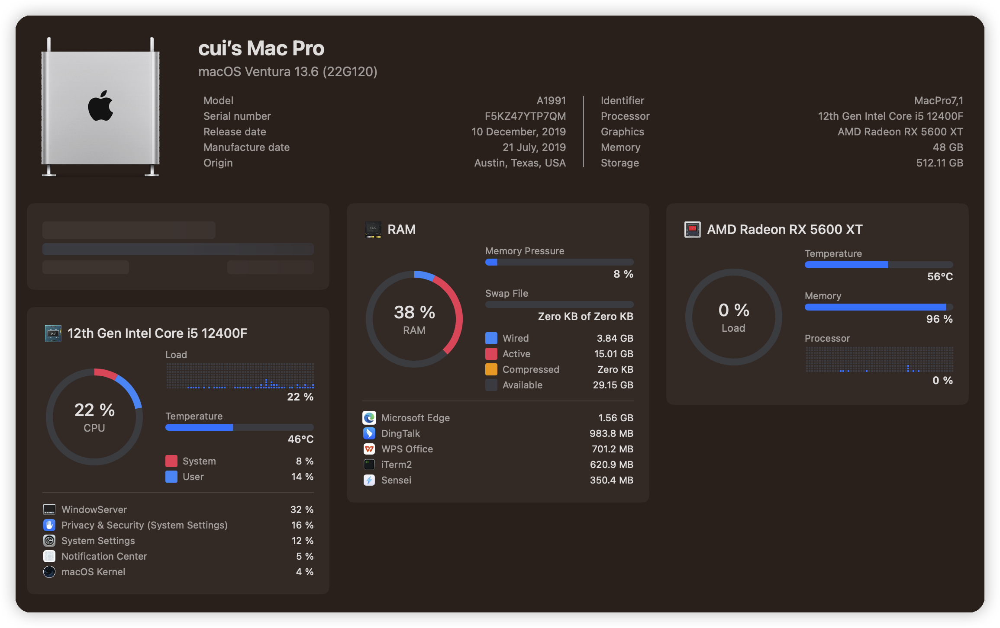

# H610-i5-1200F-RX5600XT-Hackintosh

Install macOS Ventura on Intel H610 Mainboard with Intel i5-1200F.

---

### Information 

- macOS: [Ventura](https://www.apple.com/macos/ventura/)
- bootloader: [OpenCore 0.9.5](https://github.com/acidanthera/OpenCorePkg/releases/tag/0.9.5)
- BIOS: [G610MN07](https://www.intel.com/content/www/us/en/support/intel-driver-support-assistant.html)

### Hardware

| Component    | Variant                   | Link                                                                                                                                         |
|:------------:|:-------------------------:|:--------------------------------------------------------------------------------------------------------------------------------------------:|
| Mainboard    | H610                      | [ark.intel.com](https://www.intel.com/content/www/us/en/support/intel-driver-support-assistant.html)                                         |
| Processor    | Intel Core i5 1200F       | [ark.intel.com](https://ark.intel.com/content/www/us/en/ark/products/199332/intel-core-i910900k-processor-20m-cache-up-to-5-30-ghz.html)     |
| DDR4 RAM     | Corsair 64GB              | [www.corsair.com](https://www.corsair.com/ja/zh/%E7%B1%BB%E5%88%AB/%E4%BA%A7%E5%93%81/%E5%86%85%E5%AD%98/VENGEANCE-LPX/p/CMK128GX4M4A2666C16)|
| NVMe SSD     | Lexar SSD NM620 1TB       | [www.lexar.com](https://www.lexar.com/product/lexar-nm620-m-2-2280-nvme-ssd/)                                                                |
| Graphics     | AMD Radeon RX 5600xt      | [www.amd.com](https://www.amd.com/en/products/graphics/amd-radeon-rx-6900-xt)                                                                |
| WiFi / BT    | Intel® Wi-Fi 6E AX210     | [www.intel.com](https://www.intel.com/content/www/us/en/products/sku/130293/intel-wifi-6-ax201-gig/specifications.html)                      |

---

#### Kexts

| Kext                                 | Version      | Author                                                                                                             |
|:------------------------------------:|:------------:|:------------------------------------------------------------------------------------------------------------------:|
| XHCI-unsupported.kext                | v0.9.2       | [RehabMan/OS-X-USB-Inject-All](https://github.com/RehabMan/OS-X-USB-Inject-All/tree/master/XHCI-unsupported.kext)  |
| Lilu.kext                            | v1.6.7       | [acidanthera/Lilu](https://github.com/acidanthera/Lilu/releases)                                                   |
| SMCProcessor.kext                    | v1.3.2       | [acidanthera/VirtualSMC](https://github.com/acidanthera/VirtualSMC/releases)                                       |
| SMCSuperIO.kext                      | v1.3.2       | [acidanthera/VirtualSMC](https://github.com/acidanthera/VirtualSMC/releases)                                       |
| VirtualSMC.kext                      | v1.3.2       | [acidanthera/VirtualSMC](https://github.com/acidanthera/VirtualSMC/releases)                                       | 
| RadeonSensor.kext                    | v0.3.3       | [aluveitie/RadeonSensor](https://github.com/aluveitie/RadeonSensor/releases)                                       |
| SMCRadeonGPU.kext                    | v0.3.3       | [aluveitie/RadeonSensor](https://github.com/aluveitie/RadeonSensor/releases)                                       |
| RestrictEvents.kext                  | v1.1.2       | [acidanthera/RestrictEvents](https://github.com/acidanthera/RestrictEvents)                                        |
| NVMeFix.kext                         | v1.1.1       | [acidanthera/NVMeFix](https://github.com/acidanthera/NVMeFix)                                                      |                                                           
| AppleIGC                             | v1.4.0       | [SongXiaoXi/AppleIGC](https://github.com/SongXiaoXi/AppleIGC)                                                      |
| AirpotItlwm.kext                     | v2.3.0-alpha | [OpenIntelWireless/itlwm](https://github.com/OpenIntelWireless/itlwm/releases)                                     |
| IntelBluetootchFirmware.kext         | v2.3.0       | [OpenIntelWireless/IntelBluetoothFirmware](https://github.com/OpenIntelWireless/IntelBluetoothFirmware/releases)   |
| IntelBTPatcher.kext                  | v2.6.8       | [acidanthera/BrcmPatchRAM](https://github.com/acidanthera/BrcmPatchRAM/releases)                                   |
| BlueToolFixup.kext                   | v2.6.8       | [acidanthera/BrcmPatchRAM](https://github.com/acidanthera/BrcmPatchRAM/releases)                                   |
| FeatureUnlock.kext                   | v1.1.5       | [acidanthera/FeatureUnlock](https://github.com/acidanthera/FeatureUnlock/releases)                                 |
| USBToolBox.kext                      | v1.1.1       | [USBToolBox/kext](https://github.com/USBToolBox/kext/releases)                                                     |
| UTBMap.kext                          | v1.1.1       | [USBToolBox/tool](https://github.com/USBToolBox/tool)                                                              | 

---

### Update macOS

Check the official update-guide: [OpenCore-Post-Install/update](https://dortania.github.io/OpenCore-Post-Install/universal/update.html)

1. Backup
   - Full system backup with `Time Machine` or similar software
   - Copy current EFI to OpenCore USB-Drive for recovery purpose
2. Download
   - Latest version of OpenCore and replace files in EFI
   - Updates for all installed kexts and replace in EFI
3. Reboot
   - Boot with updated OpenCore version and kexts
   - If the system doesn't boot, use OpenCore USB-Drive to roll back
4. Update
   - Start macOS Update from `System Settings` -> `Software Update`
   - With OpenCore the update process should work automatically
   - If `Software Update` shows `Mac version is up to date`, download macOS Installer from AppStore and start the update manually

If the system doesn't boot, try to fix the problem or revert to the latest EFI or system-backup.

